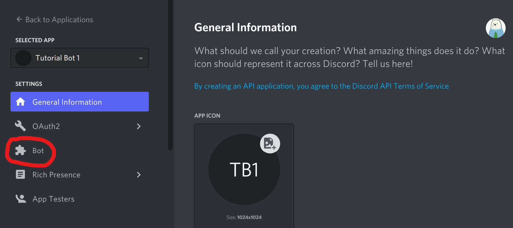
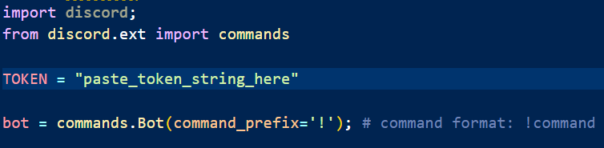
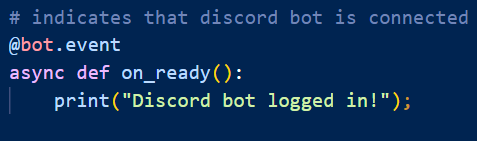
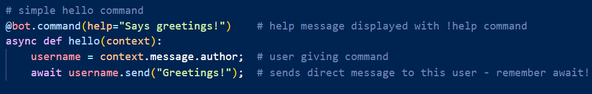

# Creating a Discord Bot with Python

## Materials needed:
- pip - https://pypi.org/project/pip/
- Discord account - https://discord.com/
- Python - https://www.python.org/downloads/

## Setup:
 1. Visit the <a href="https://discord.com/developers/docs/intro">Discord Developer Portal</a>
2. Go to the Applications tab on the left hand menu

3. Click the New Application button in the top right corner

4. Fill out the NAME field with the name of your Discord Bot and click Create

5. Navigate to the Bot tab on the left hand menu

6. Click the Add Bot button on the right hand side and confirm that you would like to create the bot

## Using Python:
1. Install the Python Discord package with `pip install discord`
2. In a new Python file, import the Discord package and include the Commands module with `from discord.ext import commands`
3. Copy the token from the Bot page in the Discord Developer Portal. Store this token in a `TOKEN` variable to be used later

4. Create the bot so that the commands start with the prefix of your choice

5. Get the bot up and running with an `event`. We'll call this event `on_ready`, which will connect the bot once it's ready. You can have the event print a message to ensure that the bot is running

6. To create a command, use `@bot.command()`. For this tutorial, we'll create a simple `hello` command 
7. Within the parentheses, you can include a brief description of the command that will appear when the `help` command is used 
8. When defining the function for your command, make sure to include the `context` parameter. This parameter will include information about the user giving this command 
9. Extract the username with `context.message.author`
10. The bot can send a greeting to this user with `await username.send("Greetings!")`

## Tutorial Credits:
